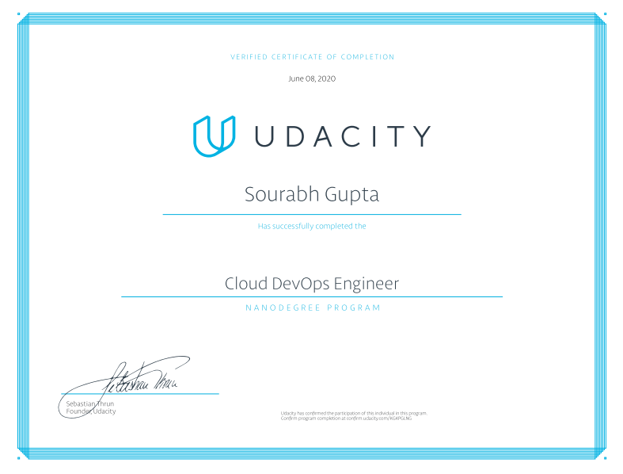

# Udacity Cloud DevOps Nanodegree

## Introduction

The Cloud DevOps Engineer Nanodegree program is geared towards operations and software engineering professionals who want to build infrastructure that delivers product and services at both speed and scale. The program includes projects that teach you how to create continuous integration and continuous delivery (CI/CD) pipelines, deploy massive infrastructure securely using code, and operationalize microservices using Kubernetes. These projects will prepare you to become a successful DevOps engineer.

## Nanodegree Certificate

[Graduation Confirmation](https://confirm.udacity.com/KGKPGLNG)

  

## Project Solutions

- [Deploy Static Website on AWS Solution](https://github.com/sourabhgupta385/deploy-static-website-on-aws)
- [Deploy a High Availability web app using CloudFormation Solution](https://github.com/sourabhgupta385/deploy-ha-web-app-using-cloudformation)
- [Build CI/CD Pipelines, Monitoring & Logging Solution](https://github.com/sourabhgupta385/udacity-project-build-cicd-pipeline)
- [Operationalize Machine Learning Microservice API Solution](https://github.com/sourabhgupta385/operationalize-ml-microservice-api)
- [Capstone Project Solution](https://github.com/sourabhgupta385/udacity-cloud-devops-capstone-project)
